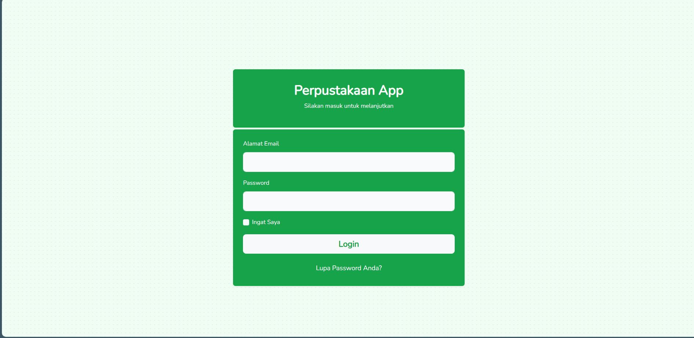
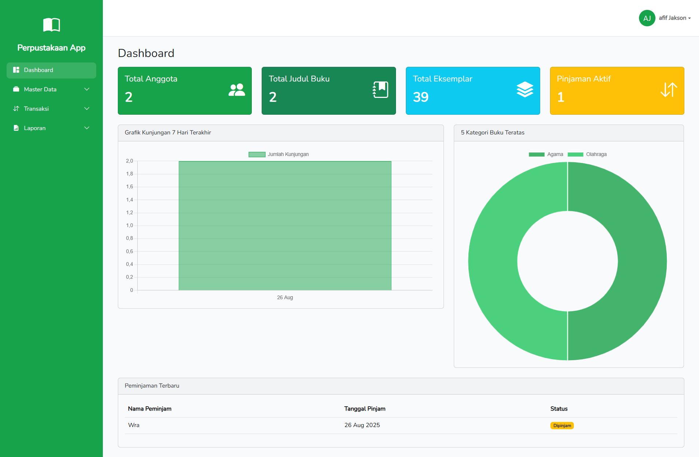
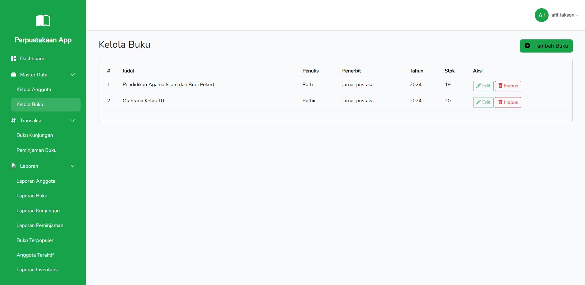
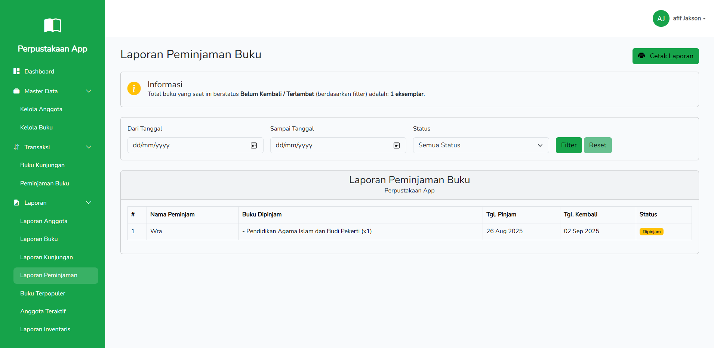

# 📚 Perpustakaan App

Selamat datang di **Perpustakaan App**!  
Sebuah sistem informasi modern yang dirancang khusus untuk menyederhanakan pengelolaan perpustakaan sekolah.  
Dibangun dengan **Laravel 10** dan **Bootstrap 5**, aplikasi ini adalah solusi lengkap untuk semua kebutuhan administrasi perpustakaan, mulai dari pendataan hingga pelaporan.

---

## 📸 Galeri Tampilan
Intip beberapa fitur unggulan dari aplikasi **Perpustakaan App**:

### 🔑 Halaman Login Minimalis

### 📊 Dashboard Penuh Informasi

### 📚 Manajemen Buku yang Rapi

### 📄 Laporan Siap Cetak

---

## ✨ Apa Saja yang Bisa Dilakukan Aplikasi Ini?

Aplikasi ini dikemas dengan fitur-fitur canggih untuk membuat manajemen perpustakaan menjadi lebih efisien dan menyenangkan.

### 📊 Dashboard Cerdas
Lihat semua informasi penting dalam sekejap di halaman utama Anda:

- **Ringkasan Data**: Pantau total anggota, judul buku, jumlah eksemplar, dan pinjaman yang masih aktif.  
- **Grafik Kunjungan**: Analisis tren pengunjung selama 7 hari terakhir.  
- **Kategori Populer**: Temukan 5 kategori buku yang paling diminati siswa.  
- **Aktivitas Terbaru**: Lihat 5 transaksi peminjaman terakhir secara real-time.  

### 📚 Manajemen Data Lengkap
Kelola semua data inti perpustakaan dengan mudah:

- **Kelola Anggota**: Tambah, edit, dan hapus data siswa dengan fitur CRUD yang lengkap. Sistem otomatis mencegah duplikasi NIS.  
- **Kelola Buku**: Atur seluruh koleksi buku Anda, mulai dari judul baru hingga pembaruan stok.  

### 🔄 Transaksi Harian yang Cepat
Proses semua aktivitas harian perpustakaan tanpa hambatan:

- **Buku Kunjungan**: Catat kehadiran siswa dengan cepat menggunakan fitur autocomplete NIS atau nama.  
- **Peminjaman Multi-Buku**: Layani peminjaman beberapa buku (termasuk judul yang sama) dalam satu transaksi. Stok akan berkurang secara otomatis.  
- **Pengembalian Satu Klik**: Proses pengembalian buku dengan mudah, sistem otomatis mengembalikan stok.  

### 📄 Laporan Detail dan Siap Cetak
Dapatkan wawasan mendalam dari data perpustakaan Anda:

- **Laporan Data**: Lihat daftar lengkap anggota dan buku dengan filter canggih (kelas, jurusan, penulis, penerbit, dll.).  
- **Laporan Aktivitas**: Analisis data kunjungan dan peminjaman berdasarkan rentang tanggal dan status.  
- **Laporan Peringkat**:  
  - 📘 **Buku Terpopuler**: Temukan 20 judul buku yang paling sering dipinjam.  
  - 👤 **Anggota Teraktif**: Lihat 10 siswa paling rajin, baik dari segi peminjaman maupun kunjungan.  
- **Laporan Inventaris**: Ringkasan total koleksi dan daftar buku yang stoknya perlu ditambah.  

---

## ⚙️ Fitur Pendukung Lainnya
- 🔐 **Keamanan**: Sistem login dan register yang aman untuk petugas.  
- 👤 **Profil Pengguna**: Setiap petugas bisa mengelola informasi akun dan mengubah kata sandi.  
- 📱 **Desain Responsif**: Tampilan tetap optimal di komputer, tablet, maupun ponsel.  

---

## 🚀 Dibangun Dengan Teknologi Modern
- **Backend**: Laravel 10  
- **Frontend**: Bootstrap 5 & Vite  
- **Database**: MySQL  
- **Visualisasi**: Chart.js  

---
